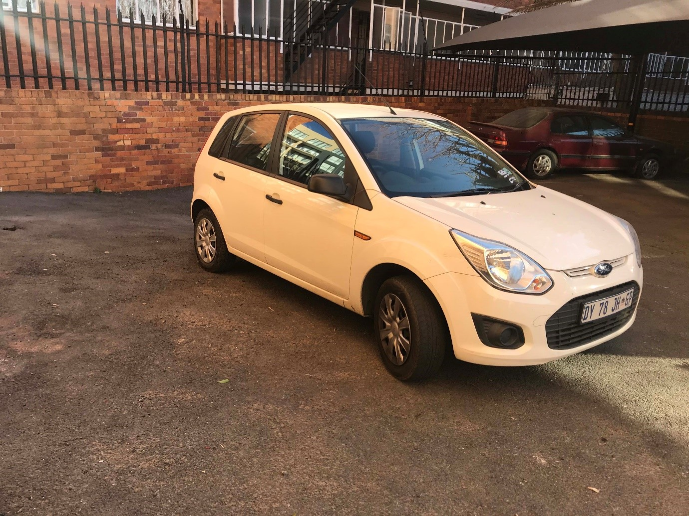
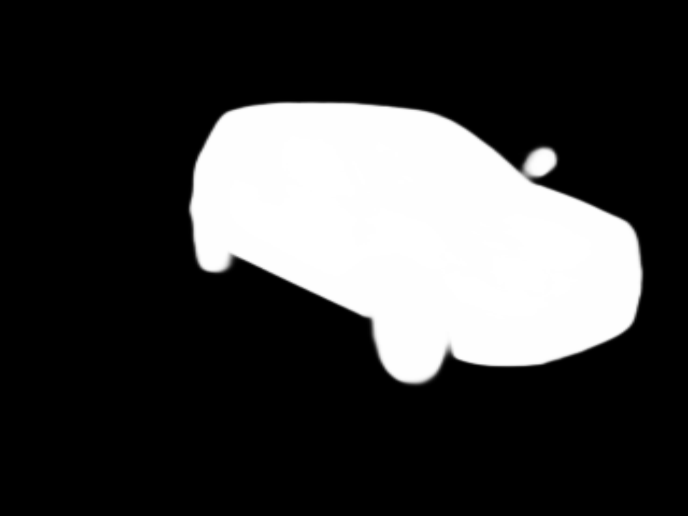
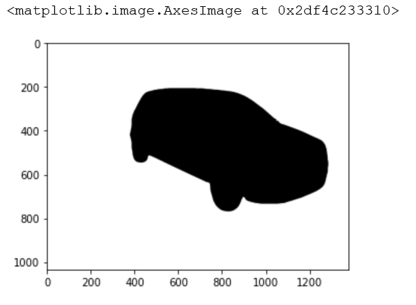
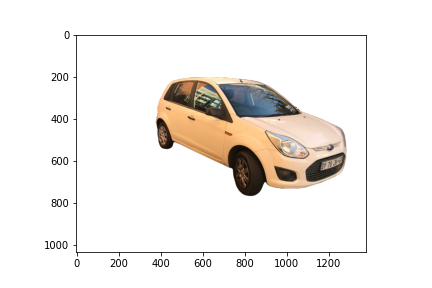

# Extracting Car/Objects form Image

Extracting objects from image is kind a difficult because you have make minor adjustments on the code each time when working with new image.
But there is a model name **U^2-Net** trained and ready to generates outout as masks of the object from input image. This makes it a lot easie to extract masks with minimum efforts.
But the model is 80% accurate, if the image background ia complex. We have to perform some minor adjustments on the the image to make it perect.

**Here is the link of U^2-Net mode repository in GitHub**

[Link](https://github.com/back8/github_NathanUA_U-2-Net)

**This is what I've done in this project.**

**I took the output geerated by U^2-Net mode and make some minor adjustments on it to get th final product**

**Input Image to the model**

 
 
 **Output image from the model**
 
 
 
 **After performing adjustments**
 
 

**Final Output**

